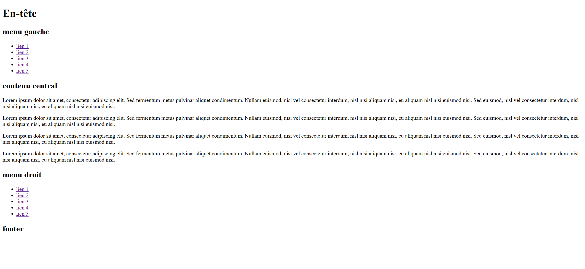
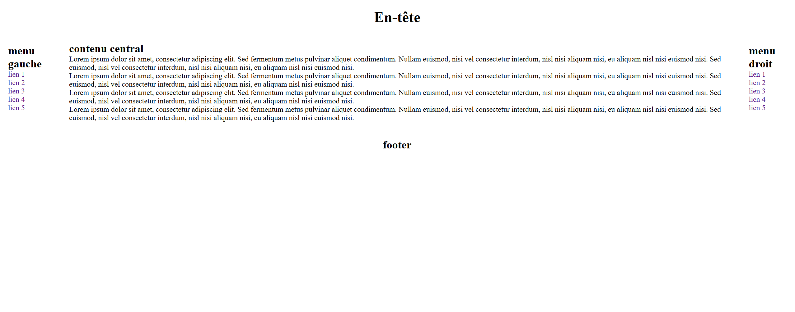
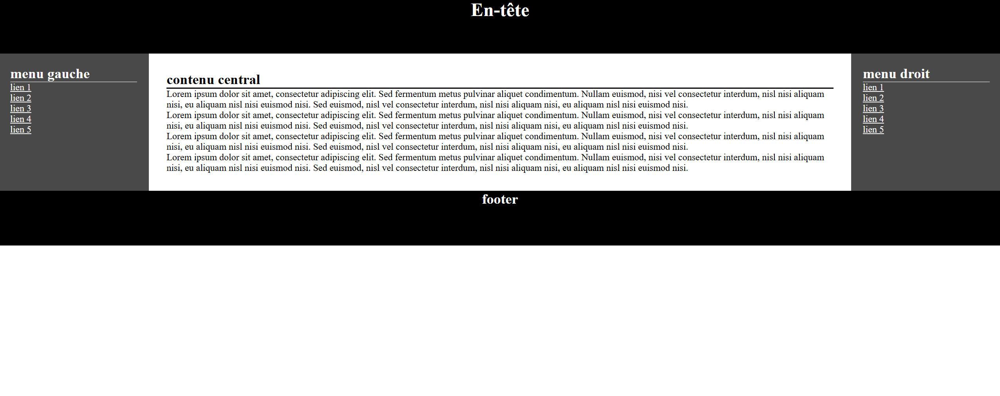
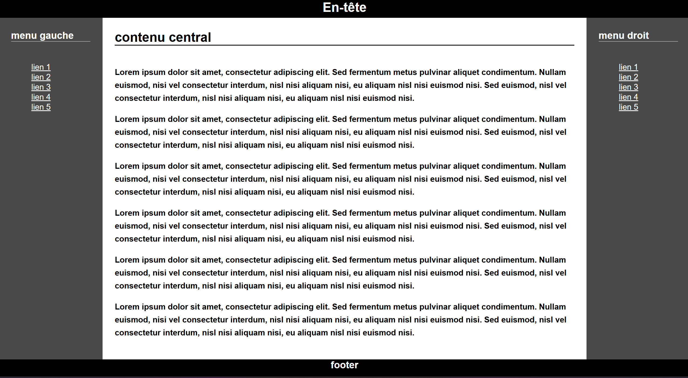

# Notes - TP N°1

## CHRISTMANN Victor - Master CEN 1

### Capture 1 : Sémantique du site mise en place

> Aucune difficultés rencontrés

### Capture 2 : Mise en place du Flexbox

> Aucune difficultés rencontrés

### Capture 3 : Mise en place du CSS (couleur, padding...)

> Aucune difficultés rencontrés

### Capture 4 : Finitions CSS

> Aucune difficultés rencontrés
