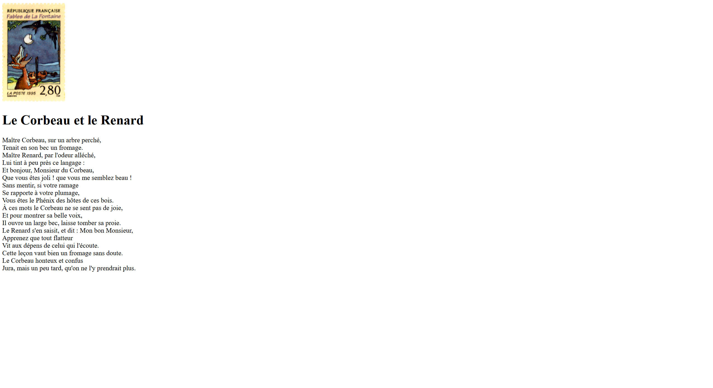
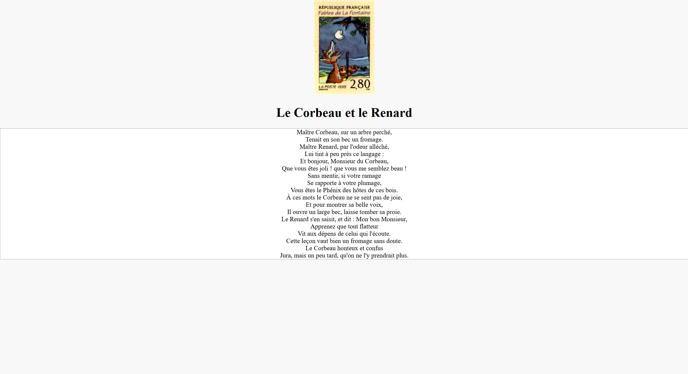
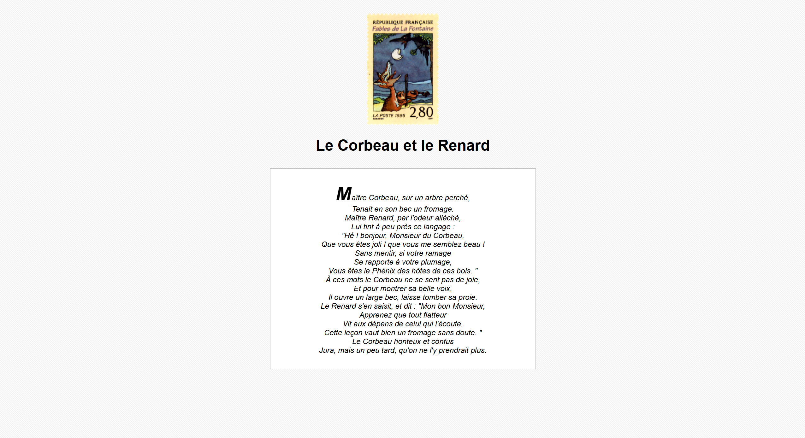

# Notes - TP N°1

## CHRISTMANN Victor - Master CEN 1

### Capture 1 : Sémantique du site mise en place

> Aucune difficultés rencontrés

### Capture 2 : Mise en forme de la page

> Aucune difficultés rencontrés

### Capture 3 : Finitions CSS

> Aucune difficultés rencontrés
